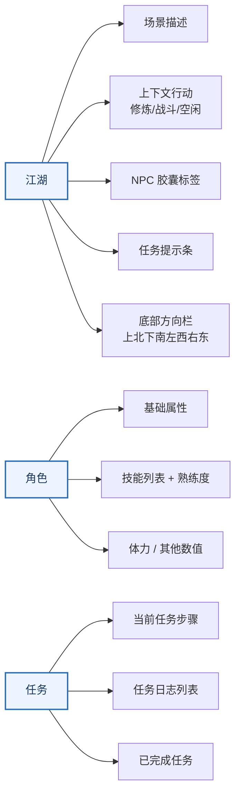

<div align="center">

<span style="font-size: 28px;"><strong>《汉末江湖录》移动端 UI 优化方案</strong></span><br/>
<span style="font-size: 18px;">基于 Grill-Me 决策访谈 · 可操作优先 · 分批交付</span>

</div>

---

# 1. 优化目标与边界

## 1.1 目标

当前所有游戏内容（场景描述、出口、NPC、属性、技能、修炼、战斗、任务日志、连接状态）平铺在一个滚动容器内。移动端纵向约 700–800px 可用高度，需上下滚动才能看到完整信息，高频操作（移动、修炼开始/停止）拇指难以触及。

本次优化目标：**首屏无需滚动即可完成"MUD 核心三问"——我在哪里？能做什么？任务要我干什么？**

## 1.2 不纳入

- 不新增功能（修炼、战斗、任务逻辑不变）
- 不替换视觉系统（水墨宣纸 token 沿用 `docs/UI_DESIGN_SPEC.md`）
- 不做动画重设计（保留现有 `unfurl` 淡入）
- 桌面端布局暂不优化（当前单列已可用，本次聚焦移动端）

# 2. 信息架构

## 2.1 底部三 Tab



| Tab | 承载内容 | 更新频率 |
|---|---|---|
| **江湖** | 场景描述、NPC、上下文行动、任务提示、方向出口 | 每次移动 / tick |
| **角色** | 先天属性、体力、技能熟练度列表 | 每秒轮询 |
| **任务** | 当前任务步骤、任务日志 | 步进变更时刷新 |

## 2.2 首屏纵向布局（江湖 Tab）

```text
┌──────────────────────────┐
│  [印章] 长安客店          │  ← 品牌窄条（~36px）
├──────────────────────────┤
│                          │
│  旧木梁撑起低矮屋檐……    │  ← 场景描述（可滚动）
│                          │
├──────────────────────────┤
│  [秦掌柜 客店掌柜]        │  ← NPC 胶囊标签
├──────────────────────────┤
│  ↳ 任务：与秦掌柜攀谈     │  ← 任务提示条
├──────────────────────────┤
│  [打坐吐纳] [练剑] [练刀] │  ← 上下文行动（空闲态）
│  [寻衅街头闲汉]           │    动态替换：
│                          │    修炼中 → 进度条 + 收功
│                          │    战斗中 → HP条 + 战报 + 撤退
├──────────────────────────┤
│    ↑北                   │
│  ←西  东→     (暂不可行)  │  ← 底部方向栏（固定）
│    ↓南                   │
├──────────────────────────┤
│  [江湖]  [角色]  [任务]   │  ← 底部 Tab 栏（固定）
└──────────────────────────┘
```

# 3. 技术方案

## 3.1 组件拆分

```text
packages/web/src/
├── App.tsx                  # 顶栏 + Tab 切换 + GameProvider
├── screens/
│   ├── WorldScreen.tsx      # 江湖 Tab
│   ├── CharacterScreen.tsx  # 角色 Tab
│   └── QuestScreen.tsx      # 任务 Tab
├── components/
│   ├── DirectionBar.tsx     # 底部方位栏
│   ├── ActionBar.tsx        # 上下文行动区（按状态切换）
│   ├── RoomScene.tsx        # 场景描述 + NPC 标签
│   ├── CombatPanel.tsx      # 战斗面板
│   ├── TrainingPanel.tsx    # 修炼面板
│   └── QuestBanner.tsx      # 任务提示条
├── context/
│   └── GameContext.tsx       # GameProvider + useGame hook
└── hooks/
    └── use-game-socket.ts   # 不变
```

## 3.2 GameContext

```typescript
interface GameContextValue {
  character: Character | null;
  connection: ConnectionState;
  room: RoomState | undefined;
  combat: CombatSnapshot['state'] | null;
  training: TrainingProgress | undefined;
  quests: QuestProgress[];
  // actions
  look: () => void;
  move: (direction: string) => void;
  talkToNpc: (npcId: string) => void;
  beginTraining: (skillId: string) => void;
  endTraining: () => void;
  beginCombat: () => void;
  flee: () => void;
}
```

`GameProvider` 包裹整个"世界"界面，内部管理 WebSocket 连接、每秒轮询、状态更新。三个 Screen 通过 `useGame()` hook 读取自己需要的状态切片。

## 3.3 关键交互细节

| 场景 | 行为 |
|---|---|
| 方向按钮不可通行 | 灰显 + 点击提示"此路不通" |
| NPC 胶囊标签点击 | 弹出 notice 文字（任务对话/无更多话） |
| 修炼中切 Tab | 后台继续结算，回到江湖 Tab 进度仍在 |
| 战斗中切 Tab | 战斗继续推进，回到江湖 Tab 战报增量显示 |
| 方向栏常驻 | position: sticky; bottom: 0; 始终可见 |

# 4. 实施计划

## 4.1 Phase 1：组件拆分 + Tab 骨架（预计 1–2 次提交）

1. 创建 `GameContext.tsx`，将 App.tsx 中的状态和逻辑迁移进去。
2. 创建 `WorldScreen.tsx` / `CharacterScreen.tsx` / `QuestScreen.tsx`——每个接收 `useGame()` 相关切片，UI 暂时沿用现有组件平铺。
3. App.tsx 改为顶栏 + Tab 切换 + GameProvider 包裹。
4. 底部 Tab 样式为三条横排文字标签。
5. **运行全部 E2E**，确认无回归。

## 4.2 Phase 2：方向栏 + 行动区优化（预计 1–2 次提交）

1. 创建 `DirectionBar.tsx`：上北下南左西右东，固定底部。
2. 创建 `ActionBar.tsx`：按状态（空闲/修炼中/战斗中）显示不同操作。
3. 场景描述保留可滚动，NPC 改为胶囊标签。
4. 品牌区收窄为一行。
5. **运行 `room.spec.ts` / `combat.spec.ts` / `skill.spec.ts` 领域 E2E**。

## 4.3 Phase 3：角色 + 任务 Tab 补齐（预计 1 次提交）

1. `CharacterScreen.tsx`：属性、体力、技能熟练度列表。
2. `QuestScreen.tsx`：当前任务详细步骤、日志列表。
3. 任务提示条在江湖 Tab 底部方向栏上方以一行紧凑显示。
4. **运行 `quest.spec.ts` / `idle.spec.ts`**。

# 5. 风险与回退

| 风险 | 缓解 |
|---|---|
| E2E 大面积失败 | 每 Phase 完成后先跑对应领域 E2E + Smoke |
| Context 重渲染性能 | WorldScreen 用 `React.memo` + selector pattern |
| Tab 切换丢失状态 | Context 持有所有状态，切换只是 UI 显隐 |
| 方向栏布局在 iOS Safari 异常 | 使用 `env(safe-area-inset-bottom)` 适配刘海屏 |

如果任一 Phase 阻塞超预期，直接将对应改动回退到上一个已知稳定提交，不做部分合入。

# 6. 决策记录

| # | 决策 | 结论 |
|---|---|---|
| 1 | 优化目标 | 可操作优先（首屏无需滚动） |
| 2 | 首屏核心内容 | 场景描述 + 出口 + 上下文行动 + 任务 |
| 3 | 二级内容访问方式 | 底部 3 Tab：江湖 / 角色 / 任务 |
| 4 | 出口位置 | 底部固定方向栏，上北下南左西右东 |
| 5 | 行动按钮位置 | 场景描述下、方向栏上，按状态动态替换 |
| 6 | 品牌区 | 进世界后收为窄横条 |
| 7 | NPC 展示 | 场景下以胶囊标签列出 |
| 8 | 修炼/战斗 UI | 替换行动区而非叠加 |
| 9 | 组件拆分 | WorldScreen / CharacterScreen / QuestScreen |
| 10 | 状态共享 | GameProvider Context |
| 11 | 交付节奏 | 三 Phase 分批，每步验证 E2E |

---

<div align="center">

<span style="font-size: 14px; color: #718096;">文档版本 v1.0 · 2025 年 7 月 · 基于 Grill-Me 决策访谈生成</span>

</div>
