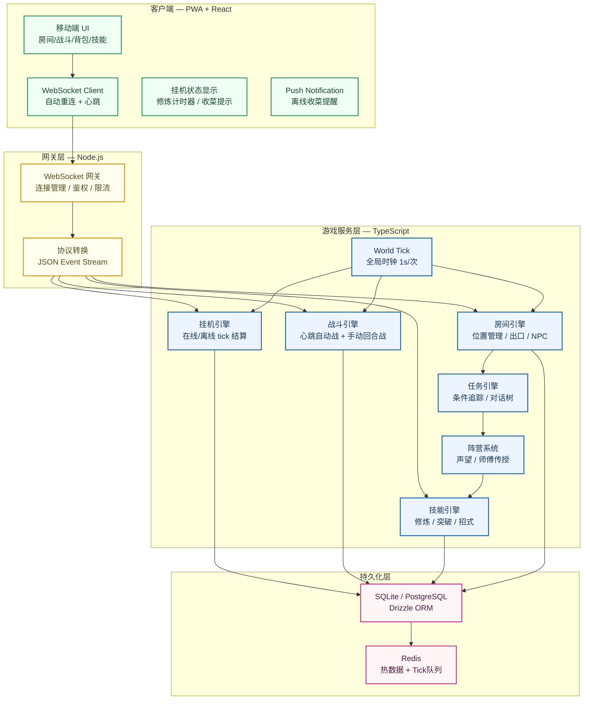
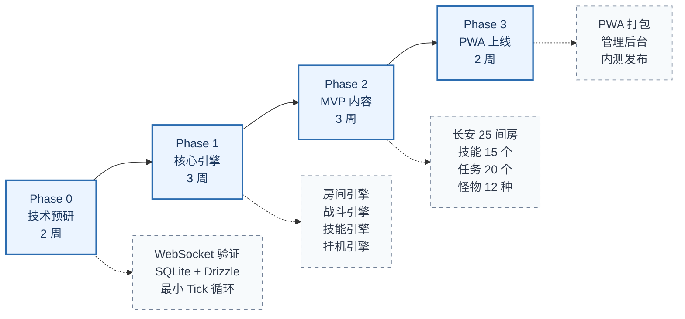

<div align="center">

<span style="font-size: 28px;"><strong>《汉末江湖录》游戏重构方案</strong></span><br/>
<span style="font-size: 18px;">从分支叙事 RPG 到开放沙盒 MUD · 移动优先 · 挂机友好</span>

</div>

---

# 1. 重构动机

## 1.1 原项目状态

《汉末江湖录》v0.2 是一套精心设计的分支叙事规则引擎——具备状态/条件/效果系统、武学路线、结局维度、多周目解锁和 JSON 内容管线。杜缄、任朔两条完整路线通过了五条代表路线的状态空间验证。

但核心体验本质上是**以选项推动的分支小说**：玩家阅读场景、从 2～5 个选项中做出选择、状态发生变化、进入下一事件。虽然有轻量 MUD 探索层（12 个长安地点、有限练功、多回合战斗），但探索层服务于叙事而非独立存在。

## 1.2 目标转变

重构目标不是放弃叙事质量，而是**将驱动模式从"作者编排的事件序列"转为"玩家在持久世界中的自主行动"**：

| 维度 | 旧模式（v0.2） | 新模式 |
|------|---------------|--------|
| 核心驱动 | 作者预设的事件链 | 玩家自主选择做什么 |
| 时间感 | 余时计数器推进历史阶段 | 真实时间 + 全局 tick 驱动 |
| 成长方式 | 剧情节点触发参悟 | 战斗、修炼、任务积累经验 |
| 重复性 | 不同路线重复同一事件池 | 持久世界中自由成长 |
| 挂机 | 不适用 | 核心特性 |
| 世界感 | 服务于当前篇章 | 独立存在的持久世界 |
| 多人 | 不适用 | 逻辑多人 + 异步社交 |

## 1.3 关键约束

- **手机碎片时间**：单次操作 30 秒～5 分钟应完成一个有意义的动作
- **挂机友好**：离线/后台应有持续收益，上线收菜有获得感
- **文字为主**：保留 MUD 的文字沉浸力，不走向图形化
- **参考 xkx2001**：深度吸收经典 MUD 的设计密度、系统和运营经验
- **三国世界观**：汉末州郡格局、阵营声望体系、历史锚点

# 2. 架构总览

## 2.1 技术栈

```text
客户端层
  ├─ React 19 + TypeScript (PWA)
  ├─ Vite 6 构建
  ├─ Tailwind CSS + 水墨宣纸视觉系统
  └─ WebSocket 长连接 (游戏协议)
        │
        ▼
网关层 (Gateway)
  ├─ Node.js + ws
  ├─ WebSocket ↔ 内部协议
  ├─ 连接管理 / 频率限制 / 鉴权
  └─ JSON 事件推送
        │
        ▼
游戏服务层 (Game Server)
  ├─ TypeScript / Node.js
  ├─ 房间引擎 (Room Engine)
  ├─ 战斗引擎 (Combat Engine)
  ├─ 技能引擎 (Skill Engine)
  ├─ 挂机引擎 (Idle Engine)
  ├─ 全局 Tick 驱动 (World Tick)
  └─ 内容管线 (YAML → Zod → 运行时)
        │
        ▼
持久化层
  ├─ SQLite (MVP) / PostgreSQL (扩展)
  ├─ Drizzle ORM
  └─ Redis (热缓存, 可选)
```

## 2.2 核心架构图



# 3. 技术架构详述

## 3.1 游戏服务层

采用**单体进程 + 模块化引擎**架构，非微服务：

- 所有引擎共享同一个 Node.js 进程，通过事件总线（EventEmitter）松耦合通信
- World Tick 以 1 秒为周期驱动所有需要时钟的模块
- 引擎之间通过类型化接口调用，不直接访问对方内部状态

### 3.1.1 World Tick

```typescript
interface TickContext {
  timestamp: number;      // Unix ms
  tickId: number;         // 自增序号
  deltaMs: number;        // 距上次 tick 的毫秒数
}

// 各引擎实现 ITickable 接口
interface ITickable {
  onTick(ctx: TickContext): void;
}
```

Tick 职责分配：

| 引擎 | 每 tick 行为 |
|------|-------------|
| 挂机引擎 | 检查在线/离线挂机的玩家，结算修炼、采集、巡逻收益 |
| 战斗引擎 | 推进心跳制战斗（自动普攻、策略技能释放） |
| 房间引擎 | 刷新 NPC 位置、重生普通怪物、推进天气/时辰 |
| 阵营系统 | 每日声望衰减、阵营事件调度 |

### 3.1.2 通信协议

继承并扩展 xkx2001 的 JSON 事件协议：

```typescript
// 服务端 → 客户端事件类型
type ServerEvent =
  | { type: "room.update"; data: RoomState }        // 场景变化
  | { type: "player.vitals"; data: Vitals }          // 气血/内力/体力
  | { type: "skills.update"; data: Skill[] }          // 武功列表
  | { type: "inv.update"; data: Item[] }              // 行囊
  | { type: "combat.event"; data: CombatLogEntry }    // 战报
  | { type: "train.event"; data: TrainEvent }         // 修炼叙事
  | { type: "idle.status"; data: IdleStatus }        // 挂机状态
  | { type: "npc.speak"; data: Speech }              // NPC 对话
  | { type: "quest.update"; data: QuestState }       // 任务更新
  | { type: "faction.update"; data: Reputation }     // 声望变化
  | { type: "notification"; data: Notification }     // 推送通知

// 客户端 → 服务端命令
type ClientCommand =
  | { type: "move"; dir: string }                    // 移动
  | { type: "look" }                                  // 观察
  | { type: "attack"; target: string }                // 攻击
  | { type: "skill"; id: string; target?: string }    // 使用技能
  | { type: "train"; skill: string; duration: number } // 修炼
  | { type: "idle.start"; config: IdleConfig }        // 开始挂机
  | { type: "idle.stop" }                             // 停止挂机
  | { type: "talk"; npc: string; topic?: string }     // 交谈
  | { type: "use"; itemId: string; target?: string }  // 使用物品
  | { type: "quest"; action: string; questId: string } // 任务操作
```

## 3.2 数据模型

### 3.2.1 核心表结构（SQLite/Drizzle）

```sql
-- 玩家
players (id, name, created_at, last_login, last_tick_at)
-- 角色（一个玩家可有多个角色，类似账号下的人物槽）
characters (id, player_id, name, gender, faction, level, exp, pot, hp, max_hp, mp, max_mp, sp, max_sp, location_room_id)
-- 先天属性
innate_attrs (character_id, str, int, dex, con)
-- 技能
character_skills (character_id, skill_id, level, proficiency, breakthrough_ready)
-- 物品
character_items (character_id, item_id, quantity, equipped_slot, durability)
-- 任务状态
character_quests (character_id, quest_id, step, variables_json)
-- 挂机状态
idle_state (character_id, mode, skill_id, start_time, end_time, is_online, config_json)
-- 阵营声望
faction_rep (character_id, faction_id, reputation, rank)
```

### 3.2.2 内容数据（YAML → Zod → 运行时）

```yaml
# rooms/changan/west_market.yml
id: changan.west_market
name: 长安西市
description: |
  这里是长安城最繁华的集市。胡商牵着骆驼，铁匠铺传来叮叮当当的锤
  打声，空气中混合着香料、药材和马汗的味道。街角几个闲汉蹲在墙根
  下掷骰子，一个说书人正拍着惊堂木招揽听众。
exits:
  east: changan.main_street
  north: changan.silk_shop
  south: changan.iron_alley
npcs:
  - id: storyteller_wang
    respawn: 300         # 5分钟重生
  - id: xian_han_1
    respawn: 180
    count: 3             # 最多同时存在 3 个
monsters:
  - id: street_thug
    respawn: 600
    max_count: 2
resources:
  - type: gather
    skill: prospecting
    yield: iron_ore
    cooldown: 120
features:
  - type: training_post
    skill: blade_mastery
    efficiency: 1.0
  - type: shop
    shop_id: iron_smith_zhang
```

## 3.3 客户端架构

复用 xkx2001 `web/app/` 的成熟组件结构：

```text
web/app/src/
├── components/
│   ├── RoomView.tsx          # 房间场景（描述 + 出口 + NPC + 资源点）
│   ├── ExitPad.tsx           # 方向罗盘（手机友好）
│   ├── CombatView.tsx        # 战斗界面（自动/手动切换）
│   ├── TrainPanel.tsx        # 修炼面板（打坐/练功/采集）
│   ├── IdleBanner.tsx        # 挂机状态条（进度/收益实时显示）
│   ├── CharacterSheet.tsx    # 角色面板
│   ├── SkillTree.tsx         # 技能树
│   ├── InventoryPanel.tsx    # 行囊
│   ├── QuestLog.tsx          # 任务日志
│   ├── MapPanel.tsx          # 地图（区域 + 大地图）
│   ├── FactionPanel.tsx      # 阵营声望
│   ├── ChatBar.tsx           # 异步社交（交易/信件/排行）
│   └── BottomNav.tsx         # 底部导航栏
├── hooks/
│   ├── useWebSocket.ts       # WebSocket 连接管理
│   ├── useIdle.ts            # 挂机状态 hook
│   └── useCombat.ts          # 战斗状态 hook
├── lib/
│   ├── protocol.ts           # 协议类型定义
│   ├── parser.ts             # 服务端消息解析
│   └── idleCalculator.ts     # 离线收益估算
└── styles/
    └── ink-wash.css          # 水墨宣纸视觉系统
```

# 4. 游戏系统设计

## 4.1 角色系统

### 4.1.1 创建流程

```text
选择性别 / 自定义姓名
→ 掷骰先天属性（可在限定次数内重掷）
→ 选择出身背景（影响起始技能和装备）
→ 降生于长安客店
→ 5 步新手引导（环顾 / 移动 / 交谈 / 修炼 / 战斗）
```

### 4.1.2 先天属性

| 属性 | 范围 | 影响 |
|------|------|------|
| 臂力 | 10-30 | 负重、近战伤害、生命上限 |
| 悟性 | 10-30 | 技能学习速度、修炼效率 |
| 根骨 | 10-30 | 内息上限、伤势恢复、抗性 |
| 身法 | 10-30 | 闪避、命中、移动体力消耗 |

每项属性经创建时掷骰（3d10）确定，最多重掷 5 次。

### 4.1.3 等级与成长

| 等级段 | 经验需求 | 解锁内容 |
|--------|---------|----------|
| 1-5 | 100-800 | 基础兵器技能、长安周边地图 |
| 6-10 | 1000-5000 | 内功心法、进阶技能、阵营入门 |
| 11-20 | 6000-30000 | 高级技能、野外 BOSS、阵营专属武学 |
| 21-30 | 35000-100000 | 绝学解锁、跨州地图、阵营高阶 |
| 31-40 | 120000-500000 | 自创招式、阵营核心、传奇装备 |

MVP 上限 10 级，后续大版本逐步解锁。

## 4.2 技能系统

### 4.2.1 技能分类

```text
技能体系
├─ 兵器类（每类独立熟练度）
│  ├─ 剑法（轻灵、点穴、速度型）
│  ├─ 刀法（刚猛、破甲、力量型）
│  ├─ 枪法（中距离、范围、控制型）
│  ├─ 戟法（重兵器、破阵、冲锋型）
│  └─ 弓术（远程、环境、先手型）
├─ 拳脚类
│  ├─ 拳法 / 掌法 / 指法 / 腿法
├─ 内功类
│  ├─ 基础吐纳（通用，影响气血/内息上限）
│  ├─ 各派心法（阵营专属，附带特殊效果）
├─ 轻功类
│  ├─ 基础身法（移动消耗、战斗闪避）
│  ├─ 各派轻功（特殊地形穿越、战斗位移）
└─ 杂学类
   ├─ 医术 / 驯马 / 锻造 / 侦查 / 阵法
```

### 4.2.2 技能成长方式

| 方式 | 收益 | 限制 |
|------|------|------|
| 找师傅学习 | 直接获得技能 + 基础熟练 | 需阵营声望/花费潜能 |
| 自行修炼 | 提升熟练度 | 在线挂机或手动，消耗时间 |
| 实战使用 | 提升熟练度（比修炼快 2-3 倍） | 需有战斗对象 |
| 参悟秘籍 | 解锁进阶招式或心法 | 需满足先天属性和前置技能 |
| 突破瓶颈 | 等级上限提升 | 需特定物品/师傅指点/实战考验 |

### 4.2.3 熟练度与招式

每项技能有 0-100 熟练度：

| 熟练度 | 阶段 | 效果 |
|--------|------|------|
| 0-29 | 入门 | 基础普攻可用 |
| 30-59 | 小成 | 解锁第 1 个招式 |
| 60-89 | 大成 | 解锁第 2 个招式，基础伤害+20% |
| 90-100 | 化境 | 解锁绝招，基础伤害+40% |

## 4.3 战斗系统

### 4.3.1 PVE 挂机战斗（自动心跳制）

适用于野外刷怪、巡逻、押镖等日常战斗：

```text
每 2 秒一个心跳：
1. 我方自动普攻（基于武器 + 兵器技能等级计算伤害）
2. 检查战斗策略：HP < 阈值？→ 吃药 / 逃跑
3. 检查战斗策略：敌方特殊状态？→ 释放指定技能
4. 敌方自动普攻或随机技能
5. 更新双方状态 → 推送战报
6. 判断胜负 / 继续下一轮
```

战斗策略面板（可视化配置，不需要写脚本）：

```text
┌─────────────────────────────┐
│  战斗策略          [保存]   │
│                             │
│  气血低于 [30]% 时：        │
│    ○ 使用金疮药             │
│    ○ 使用技能 [回春诀]      │
│    ○ 逃跑                   │
│                             │
│  敌方处于 [防御架势] 时：    │
│    ○ 使用 [破甲剑法]        │
│    ○ 继续普攻               │
│                             │
│  优先攻击：                 │
│    ○ 血量最少               │
│    ○ 威胁最高               │
│    ○ 最近的                 │
└─────────────────────────────┘
```

### 4.3.2 BOSS / 剧情战（手动回合制）

继承当前项目的设计精华——每轮 15 秒选择：

```text
┌─────────────────────────────────┐
│  ◇ 将军府正堂 ◇                 │
│                                 │
│  李傕横刀而立，眼中闪着凶光。    │
│  他已受伤，但气势不减。          │
│                                 │
│  【距离：中】【敌方意图：蓄力斩】 │
│  【你的 HP: 85/100 MP: 2/3】   │
│                                 │
│  ┌─────────────────────────┐   │
│  │ [试探] 观察破绽          │   │
│  │ [抢攻] 趁蓄力时抢先攻击  │   │
│  │ [格挡] 准备承受重击      │   │
│  │ [游身剑] 消耗1内息，绕后  │   │
│  │ [撤退] 放弃战斗          │   │
│  └─────────────────────────┘   │
│  [14] 秒后自动格挡             │
└─────────────────────────────────┘
```

### 4.3.3 底层伤害公式（继承 xkx2001 经验）

```
最终伤害 = 基础伤害 × (1 + 臂力修正) × (1 + 技能等级修正)
         × (1 + 武器修正) - 目标防御 × (1 + 根骨修正)

命中判定 = 攻击方身法 × 技能命中率 - 目标身法 × 闪避率
         + 随机值(0-20)

暴击判定 = 攻击方悟性 / 100（悟性 20 = 20% 暴击率）
```

## 4.4 挂机系统

### 4.4.1 三种模式

| 模式 | 触发条件 | 收益效率 | 可做范围 | 持续条件 |
|------|---------|----------|---------|---------|
| 手动操作 | 在线 + 主动操作 | 100% | 全部 | 玩家操作 |
| 在线挂机 | 在线 + 开启自动 | 100% | 修炼/采集/巡逻 | WebSocket 保持连接 |
| 离线挂机 | 下线前设置 | 50-60% | 修炼/简单采集 | 无（服务端 tick 模拟） |

### 4.4.2 离线挂机流程

```text
玩家下线前：
1. 在安全点（客栈/门派/自宅）选择离线修炼或采集
2. 设置目标（修炼 xx 技能 / 采集 xx 材料）
3. 服务端记录 idle_config

玩家离线期间：
1. World Tick 每 60 秒为离线玩家结算一次
2. 收益按在线效率的 50-60% 计算
3. 如果期间被 PK 或房间状态变化，按预设策略处理

玩家上线时：
1. 一次性结算离线收益 → 推送"收菜"通知
2. 展示离线期间的修炼记录和收获
3. 最多累积 8 小时收益
```

### 4.4.3 挂机内容

| 挂机类型 | 消耗 | 产出 | 风险 |
|---------|------|------|------|
| 打坐修炼 | 无 | 内功熟练度、内息上限微提升 | 无（安全点） |
| 练功 | 体力 | 兵器/拳脚技能熟练度 | 无（安全点） |
| 采集 | 体力 | 药材/矿石/木材 | 安全点无风险 |
| 巡逻 | 体力 | 经验、熟练度、随机掉落 | 遇敌自动战斗 |
| 押镖 | 押金 | 银两、阵营声望 | 可能被劫（后期 PVP） |
| 读书 | 无 | 悟性微提升、知识 | 无（安全点） |

## 4.5 阵营系统

### 4.5.1 初始三阵营

| 阵营 | 核心区域 | 特色武学 | 入门要求 |
|------|---------|---------|---------|
| 汉室残存 | 长安宫城周边 | 正统剑法、宫廷心法、王道内功 | 完成王允府任务链 |
| 董卓旧部 | 郿坞、西凉军营地 | 西凉刀法、骑兵枪术、霸道心法 | 完成李傕军任务链 |
| 江湖中立 | 长安西市、各处客栈 | 各类散修武学、偏门杂学 | 默认身份 |

### 4.5.2 声望机制

- 每个阵营独立声望值（-3000 ~ 3000）
- 声望影响：可学习的技能等级、NPC 对话选项、任务解锁、商品折扣
- 阵营间并非完全互斥：可以在汉室和董卓双方都有声望，但高级内容需要一定程度的忠诚
- 每日小幅衰减（-5 ~ -10），防止长期不上线声望不动

### 4.5.3 师傅系统

```text
声望 500：入门师傅 → 教授基础技能
声望 1000：进阶师傅 → 教授进阶招式
声望 2000：核心师傅 → 教授绝学、专属任务
声望 3000：阵营领袖 → 传授镇派武学、参与阵营决策
```

## 4.6 世界系统

### 4.6.1 双层地图

**城池层（房间制）**：

```text
长安城（MVP ~25 间房）
├─ 宫城外围区域（5间）
│  ├─ 东阙门 → 南宫广场 → 西阙门
│  └─ 王允府外巷 → 王允府正堂
├─ 西市（6间）
│  ├─ 西市大街 → 铁匠铺 / 药铺 / 当铺
│  └─ 西市废仓 → 废寺偏殿
├─ 闾里民居（5间）
│  ├─ 军属里巷 → 后院 → 军营小路
│  └─ 长安西门 → 城门内侧
├─ 东市（4间）
│  └─ 茶馆 / 客栈 / 书肆 / 马市
└─ 客店（3间）
   ├─ 大堂 → 雅房 → 后院马厩
```

**大地图层（路径制）**：

```yaml
routes:
  - id: changan_to_tongguan
    name: 崤函古道
    segments:
      - name: 长安东门 → 灞桥
        length: 2   # 每段 2-5 分钟移动时间
        encounters:
          - type: bandit
            chance: 25%
          - type: merchant_caravan
            chance: 15%
          - type: escaped_horse
            chance: 5%
      - name: 灞桥 → 潼关
        length: 3
        encounters:
          - type: patrol
            chance: 30%
          - type: wounded_soldier
            chance: 10%

  - id: changan_to_meiwu
    name: 长安 → 郿坞
    segments:
      - name: 长安西门 → 郿县
        length: 2
      - name: 郿县 → 郿坞
        length: 3
        restricted: true   # 需董卓阵营声望
```

### 4.6.2 NPC 行为模型

```typescript
interface NPCSchedule {
  npcId: string;
  entries: ScheduleEntry[];
}

interface ScheduleEntry {
  gameTime: string;       // 游戏内时辰 "卯时" / "午时" / "酉时"
  location: string;       // 房间 ID
  activity: string;       // "站岗" / "吃饭" / "睡眠" / "巡逻"
  dialoguePool: string[]; // 当前活动的对话池
}
```

- 关键 NPC 有日程表，不同时间在不同地点
- 普通 NPC（小贩、卫兵）24 小时在原地或循环巡逻
- 怪物有重生计时器（普通怪 3-10 分钟，精英怪 30-60 分钟，BOSS 2-6 小时）

### 4.6.3 时辰与天气

- 游戏内 1 天 = 现实 4 小时（1 时辰 = 20 分钟）
- 昼夜影响：夜晚需要灯笼/火把，部分 NPC 不会出现，某些怪物只在夜间刷新
- 天气系统（MVP 简单版）：晴/阴/雨/雪，影响移动速度和某些技能效果

## 4.7 任务系统

### 4.7.1 任务类型

| 类型 | 触发方式 | 可重复 | 示例 |
|------|---------|--------|------|
| 主线任务 | 等级/声望达标自动触发 | 否 | "王允的密令" |
| 阵营任务 | 与阵营 NPC 交谈 | 每日 | "护送粮草至潼关" |
| 悬赏任务 | 告示板/酒馆打听 | 每日刷新 | "击杀西市劫掠者" |
| 奇遇任务 | 随机触发（低概率） | 一句一遇 | "废寺中发现残破秘籍" |
| 引导任务 | 新手村自动解锁 | 否 | "初入长安" |

### 4.7.2 任务数据结构

```typescript
interface Quest {
  id: string;
  name: string;
  type: "main" | "faction" | "bounty" | "adventure" | "guide";
  steps: QuestStep[];
  requirements: Condition[];
  rewards: Reward[];
  repeatable: boolean;
  cooldown?: number;    // 可重复任务的冷却时间（秒）
}

interface QuestStep {
  id: string;
  description: string;
  type: "talk" | "kill" | "collect" | "goto" | "use_skill" | "choice";
  target: string;       // NPC ID / 怪物 ID / 物品 ID / 房间 ID
  count?: number;
  choices?: Choice[];   // 分支选项
  completionText: string;
}
```

## 4.8 异步社交

### 4.8.1 MVP 包含

| 系统 | 说明 |
|------|------|
| 门派贡献榜 | 阵营声望排名，每周重置赛季奖励 |
| 悬赏榜 | 击杀 BOSS 的首通/最快记录 |
| 信件系统 | 玩家间异步消息（游戏内邮件） |
| 世界公告 | BOSS 首杀、绝学现世、阵营事件 |

### 4.8.2 MVP 后添加

| 系统 | 说明 |
|------|------|
| 交易行 | 玩家挂单买卖材料/装备，异步交易 |
| 切磋榜 | PVP 排位（手动回合制，策略快捷栏） |
| 帮会 | 玩家自建组织，帮会任务、帮会仓库 |
| 江湖传闻 | 系统生成的"新闻"，记录服务器内的大事件 |

# 5. MVP 范围：《长安纪》初平元年

## 5.1 交付目标

> 一个玩家能在长安城内自由探索、战斗成长、修炼挂机，并在 2-3 天内完成从 1 级到 10 级的完整循环。

## 5.2 内容清单

| 类别 | 数量 | 详情 |
|------|------|------|
| 主城房间 | 20-30 间 | 长安城（宫城外围 + 东西两市 + 闾里 + 客店） |
| 野外路径 | 2 条 | 长安→潼关（3段）、长安→郿坞（3段） |
| 小型据点 | 3-5 个 | 废寺、郿县小村、灞桥驿站、潼关前哨 |
| NPC | 15-20 名 | 关键 NPC 5 名（有日程表）、普通 NPC 10-15 名 |
| 怪物 | 8-12 种 | 普通怪（街头闲汉、西凉散兵、野狼）、精英（劫掠者头目）、BOSS（郿坞守将） |
| 技能 | 10-15 个 | 剑法 2 套 / 刀法 2 套 / 内功 2 种 / 轻功 1 种 / 杂学 3 种 |
| 装备 | 30-50 件 | 每类兵器 3-5 把、衣甲 5-8 件、饰品 5 种、消耗品 5 种 |
| 任务 | 15-20 个 | 引导任务 5 步 + 主线 3 个 + 阵营日常各 3 个 + 悬赏 2 个 |
| 挂机模式 | 4 种 | 打坐 / 练功 / 采集 / 巡逻 |

## 5.3 MVP 明确不做

- 跨州旅行（司隶以外区域）
- 门派系统 / 师承谱系
- PVP / 排行榜 / 交易行
- 帮会 / 结婚 / 师徒
- 坐骑 / 宠物
- 天气系统
- 锻造 / 附魔 / 装备品质颜色
- 付费系统
- 完整经济循环

## 5.4 MVP 新手引导序列

```text
第 0 分钟：创建角色（掷骰重掷 + 选择背景）
第 1 分钟：降生长安客店 → "环顾" → 与店小二"交谈"
第 2 分钟："前往"长安西市 → 观察场景
第 3 分钟：与铁匠"交谈" → 获得新手武器
第 4 分钟：前往城外"巡逻" → 第一场挂机战斗
第 5 分钟：回客店 → 跟师傅"打坐" → 学习第一个内功
第 6 分钟：接收第一个阵营任务
第 7-10 分钟：自由探索，完成引导里程碑
```

# 6. 实施路线

## 6.1 阶段划分



## 6.2 Phase 0：技术预研（2周）

| 任务 | 产出 | 验收标准 |
|------|------|---------|
| 项目脚手架搭建 | monorepo（server/gateway/web）| `pnpm dev` 三端同时启动 |
| 数据库层 | Drizzle + SQLite schema + 迁移 | CRUD 测试通过 |
| WebSocket 通信 | 服务端推送 → 网关 → 前端接收 | 延迟 < 100ms |
| World Tick 原型 | 1 秒 tick 循环驱动简单状态变化 | 10 个并发角色在线 1 小时无故障 |
| xkx2001 核心系统提取 | 战斗公式 / 技能表 / NPC 行为文档 | 提取文档完成 |

## 6.3 Phase 1：核心引擎（3周）

| 引擎 | 关键功能 | 验收标准 |
|------|---------|---------|
| 房间引擎 | 位置管理 / 出口 / NPC 刷新 / 怪物重生 | 50 间房遍历正确 |
| 战斗引擎 | 自动心跳战 / 手动回合战 / 战报生成 | 5 轮战斗结算正确 |
| 技能引擎 | 学习 / 修炼 / 熟练度 / 招式解锁 | 技能树全链路走通 |
| 挂机引擎 | 在线挂机 / 离线挂机 / 收益结算 | 离线 1 小时后上线收菜 |
| 任务引擎 | 对话树 / 条件检查 / 奖励发放 | 1 条完整任务链执行 |
| 阵营系统 | 声望计算 / 师傅传授 | 声望达标后学到技能 |

## 6.4 Phase 2：MVP 内容（3周）

| 内容 | 数量 | 负责人 |
|------|------|--------|
| 长安房间 | 25 间 | 策划 + 程序员用 YAML |
| 野外路径 | 2 条共 6 段 | 策划 |
| 技能定义 | 剑/刀/内功/轻功/杂学共 15 个 | 策划 |
| 装备物品 | 40 件 | 策划 |
| NPC 与对话 | 20 名 + 任务对话 | 策划 |
| 怪物配置 | 12 种 + BOSS 1 个 | 策划 |
| 任务链 | 引导 + 主线 + 日常共 20 个 | 策划 |
| 管理后台 | 基础版 | 程序员 |

## 6.5 Phase 3：PWA 上线（2周）

| 任务 | 验收标准 |
|------|---------|
| PWA 配置 | 添加到主屏幕 / 离线缓存 / 推送通知 |
| 内测部署 | 单台云服务器跑全栈 |
| 性能压测 | 50 并发挂机 + 50 并发手动操作 |
| 新手引导 | 5 分钟完整新手流程 |
| 发布 | 邀请制内测（20-50 人）|

## 6.6 长期路线

```text
MVP (v0.5): 长安一城 + 完整闭环 (10 周)
    │
v0.6: 洛阳废墟 + 交易行 + 排行榜 (6 周)
    │
v0.7: 阵营战 + PVP 切磋 + 帮会系统 (8 周)
    │
v1.0: 司隶全境 + 凉州 + 三大阵营完整内容 (12 周)
    │
后续版本: 按历史节点逐步扩展至三国全境
```

# 7. xkx2001 经验吸收

## 7.1 直接复用的设计

| 来源 | 复用内容 | 在新项目中的应用 |
|------|---------|-----------------|
| `d/` 房间体系 | 房间定义模式（short/long/exits/objects/item_desc） | 重构为 YAML + Zod，逻辑结构保留 |
| `kungfu/` 技能系统 | 技能层级、熟练度与招式解锁的关系 | 保留结构，减少技能数量，增加招式可视化 |
| 心跳战斗 | 2-3 秒自动普攻 + 手动技能释放 | 升级为策略面板配置，去掉命令行 |
| `assistd.c` | 挂机助手逻辑、停止条件 | 挂机引擎的核心灵感来源 |
| `webd.c` | JSON 结构化事件推送 | 直接继承协议设计思路 |
| gateway 架构 | WebSocket ↔ TCP 桥接 | 简化为 WebSocket 直连游戏服务 |
| Web 前端组件 | RoomView/ExitPad/TrainSheet/CombatSheet | 直接复用组件结构和交互模式 |
| 扬州首发区经验 | 从 1 城起步逐步扩展的策略 | 长安首发战略 |

## 7.2 刻意简化的部分

| xkx2001 做法 | 问题 | 新做法 |
|-------------|------|--------|
| 全图 6400 间房 | 内容产能跟不上 | 双层地图，城池房间制 + 野外路径制 |
| 数百种技能 | 手机 UI 无法承载 | 每类 3-5 种，集中打磨 |
| 门派拜师锁定 | 限制了探索自由度 | 阵营声望 + 多师傅学习 |
| 纯文字命令 | 手机输入成本高 | 按钮优先 + 文字命令作为快捷方式 |
| 玩家自写触发器 | 普通人不会写 | 可视化策略配置面板 |
| LPC 语言 | 团队无法维护 | TypeScript，全栈统一 |

# 8. 旧项目资产处理

## 8.1 归档策略

旧仓库 `three-kingdoms-wuxia-mud` 保留为设计档案：

```text
新仓库（three-kingdoms-mud 或新名称）
├── server/          # 游戏服务层
├── gateway/         # WebSocket 网关
├── web/             # PWA 前端
├── content/         # YAML 内容数据
├── tools/           # 管理后台 + 内容校验工具
└── docs/
    ├── RECONSTRUCTION.md   # 本文档
    └── legacy/             # 旧项目设计档案（只读）
        ├── VISION.md
        ├── SYSTEM_DESIGN.md
        ├── GAME_CONCEPT.md
        ├── MVP_DESIGN.md
        ├── STORY_BIBLE.md
        ├── MUD_MECHANICS_REFACTOR.md
        ├── CONTENT_SCHEMA.md
        ├── UI_DESIGN_SPEC.md
        ├── DU_JIAN_ROUTE.md
        ├── REN_SHUO_ROUTE.md
        └── ...
```

## 8.2 设计思想的转化

| 旧设计资产 | 转化去向 |
|-----------|---------|
| 条件/效果系统 | 任务引擎的条件检查 + 战斗策略的条件触发 |
| 伤势/风声/自由状态模型 | 角色状态系统的一部分（保留完整五级伤势机制） |
| 武学路线设计（守剑/游剑/破阵/护军） | 阵营师傅传授的技能路线（汉室剑法 / 西凉刀法） |
| 结局维度 | 角色生涯档案（每季度/每年展示） |
| 多周目解锁 | 一个玩家多角色的跨角色传承（类似 xkx2001 的转世） |
| 行止标签 | 保留为角色的"江湖名声"属性 |
| 水墨宣纸视觉系统 | PWA 前端的视觉规范，直接复用 |
| JSON 内容 Schema | 升级为 YAML + Zod，保留校验思想 |
| 杜缄/任朔故事线 | 转化为长安地区的阵营任务链素材 |
| E2E 测试框架 | 继承 Playwright + 自动化回归思路 |

# 9. 核心设计原则（重构后保留）

这些原则从旧项目继承，在新架构下依然适用：

1. **确定性优先**：关键判定不由隐藏随机数决定，条件公开，代价透明
2. **离散状态优先**：玩家面对的不是计算器，而是有意义的词语和标签
3. **规则与文本分离**：文字负责氛围，规则负责唯一真实状态
4. **内容数据驱动**：房间/NPC/技能/任务尽量由结构化数据描述，引擎不写死
5. **扩展不等于预先实现**：为未来保留稳定接口，MVP 不实现推测性功能
6. **移动端优先**：所有核心操作在手机上不输入任何文字即可完成
7. **失败有意义**：死亡、被捕、技能瓶颈都可以是成长路径的一部分

# 10. 风险与缓解

| 风险 | 等级 | 缓解策略 |
|------|------|---------|
| 挂机游戏"不上线等收菜" | 中 | 离线收益上限（8h）+ 关键内容（BOSS/任务/奇遇）只能在线体验 |
| Node.js 单进程性能瓶颈 | 低 | xkx2001 gateway 已验证；先压测，瓶颈时拆分引擎为 worker threads |
| PWA 在国产手机后台保活差 | 中 | Phase 0 真机测试；如不行则加 Service Worker 推送 + 离线结算收菜模式 |
| 策划产能跟不上内容消耗 | 高 | MVP 只做 25 间房；内容管线（YAML+后台）降低策划门槛；考虑社区 UGC |
| 三国世界观与 MUD 数值的平衡 | 低 | 以武侠 MUD 为骨架，三国为皮肤和阵营体系，不做过于复杂的政治模拟 |
| 旧玩家期望延续分支叙事 | 低 | 明确沟通：重构后产品方向改变，分支叙事作为任务系统的一部分保留 |

---

<div align="center">

<span style="font-size: 14px; color: #718096;">文档版本 v1.0 · 2025 年 7 月 · 基于 Grill-Me 决策访谈生成</span>

</div>
